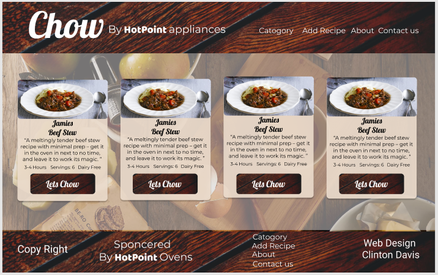
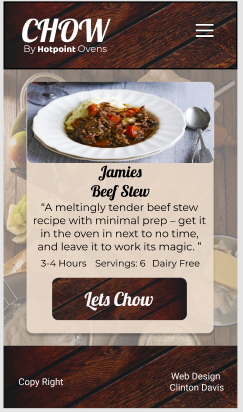
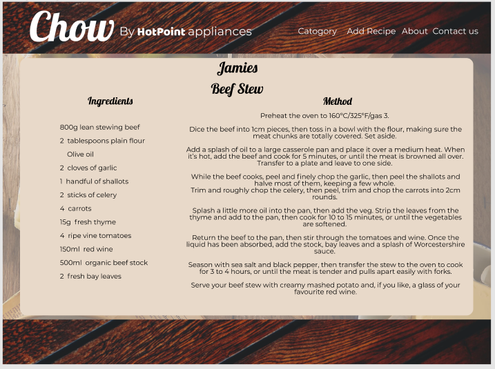
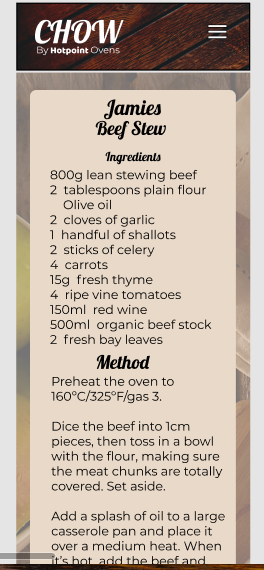
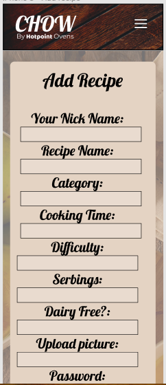
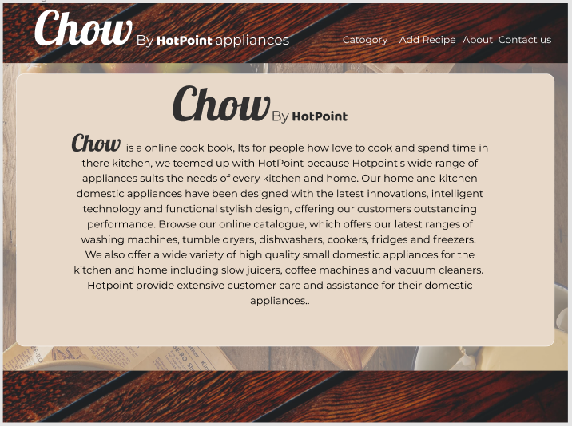
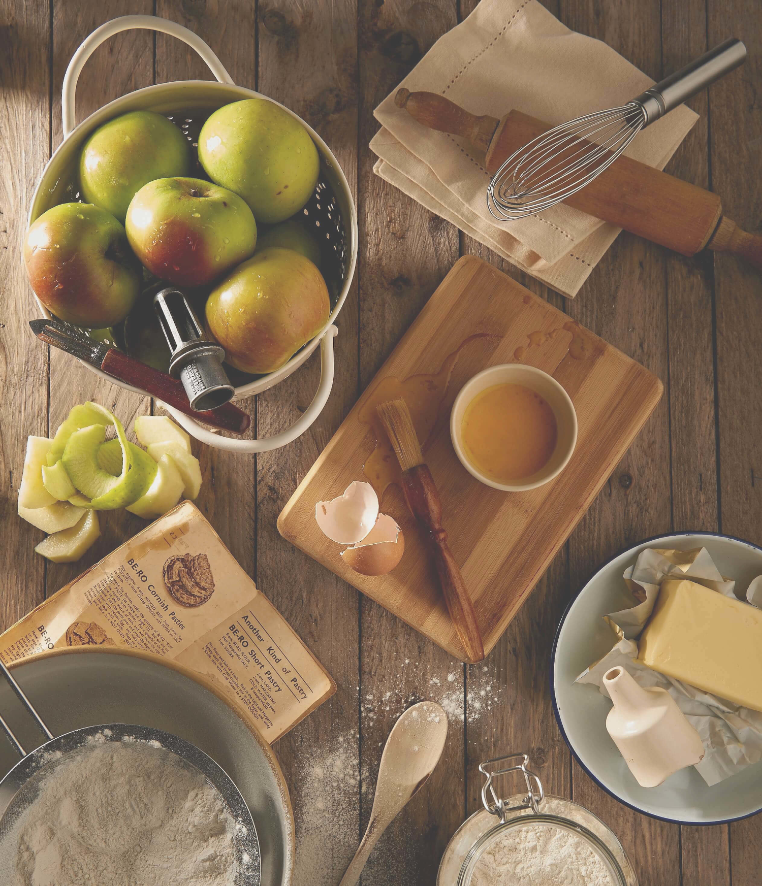

# Chow by HotPoint

## Data Centric Development - Code institute

---

added rel="noopener" for sercity

**Chow by Hot Point** is a Web based Cook Book That allows anyone to upload a recipe and share it with the world.

---

    

## Demo

---

---

## Table of Contents

1. [**UX**](#ux)
2. [**Scope**](#scope)
3. [**Structure and Wireframe Mockups**](#structure)
4. [**Surface**](#surface)
5. [**Technologies**](#technologies)
6. [**Functions and Features**](#features)
7. [**Testing**](#testing)
8. [**Bugs**](#bugs)
9. [**Deployment**](#deployment)
10. [**Credits**](#credits)
11. [**Acknowledgements**](#acknowledgements)

---

## UX

My directive was to make an on line cookbook that users could find and share recipes, at the same time promote the Hotpoint brand. All the tools nedded to cook all the recipes the user can get from HotPoint.

### User Stories

1. I would like to be able to look up recipes I like from the Chefs I like.

2. I would like to have all the recipes I like in one place.

3. I would also like to be able to edit them if I like on the app.

4. I would like to have my friends and family share our recipe we like so we can all enjoy them.

---

## Scope

---

**Chow by HotPoint** is a web-based cookbook that lets the public browse and uses recipes that users have uploaded. Anyone can choose a recipe and get a list of ingredients and cooking instruction. If the public would like to contribute to the collection, they would have to become a user.
To become a user, you would have to register. Once registered, you would be able to use the service. The user can keep a collection of there own with full editing or delete capabilities.

The web app is made using [Python](https://www.python.org/)and [JavaScript](https://developer.mozilla.org/en-US/docs/Web/JavaScript) as the main logical languages [Flask](<https://en.wikipedia.org/wiki/Flask_(web_framework)>) and [Boostrap](https://getbootstrap.com/) Frameworks with [Mongodb](https://www.mongodb.com/) Altes for the database.

The Client HotPoint, has a wide range of products that cover all things a house should have, As the heart of every home is the kitchen. Here is there focus on Chow. The logo is in the main title, On every page. Pictures of the products have been strategically placed throughout the site, with links to their website.

---

## Structure

There are five main pages, two error handing pages and one 'Base' page. Because we are using [Flask](<https://en.wikipedia.org/wiki/Flask_(web_framework)>) we are able to utlise the [Jinja2](https://jinja.palletsprojects.com/en/2.11.x/) templating lanuguage. Therefore the 'Base' page is the same in all pages in the site. This is the reason it contains the Navigation and the footer. [Boostrap](https://getbootstrap.com/) framework alows the Navigation header and footer to be fully responsive.

---

####**Navigation**
In the section of the head, On the left hand side you see the Logo. It is made with two parts. The Chow is clickable and will refresh the page for you. The second part, is the HotPoint logo wich is also clickable and will direct you to the Hot Point web page.
On the left of that are the navigate. Here are the direct link to _catergory drop down menu / Add Recipe / About / Login / Search bar_.

**Catergory drop down menu**

- All the _**Categories**_ are shown here, when clicked, only the recipes in that catergory will be shown
- _**Chefs**_ (Aurthers of the recipes)This will show all the different chefs in alphabetical order.
- _**Serving**_ shows the recipes in order of serving size from smallest to largest.

_**Add Recipe**_: This will redirct you to the add recipe page if you are login in, other wise if will redirct you to the login in page, if the user has not registered with Chow before, ther is a link to do so in the login page.

_**About**_: Click on this will send the user to a page with a discription of the Chow and HotPoint. There are two button, Go Back or learn more.

- Go Back - will bring you back to Chow main page

- Learn More - Will redirct you to Hot Points main web page

_**Login**_ : Here you will be redircted to the Login/Registration page. Its a simple form where the user email and password are required.

_**Registration**_: Is the same as the Login form but with a Nick name / Username input. Once the username has been added it can not be change.

---

#### **All Recipes**

All Recipes is the first page we get to see, All the recipes uploaded by the users are seen here. The page is "Card" based with a 'snap' shot of the details and a web-based image of the dish. The order is newest first by default.
The design of this is made for browsing, to be scanned over when looking for dinner tonight. Once the recipe is selected, the "Lets Chow" button brings you to the Recipe page.

All Recipes Wireframes

---

#### **Recipe**

The recipe page is a center block format with all the details of the recipe.
The name with a short description and dish image.
Here you will find all the details you will need to make the dish.
A list of all the Ingreadients and Cooking instruction neatly laid out and easy to read.
It is from here you will be given the option to edit or delete a recipe. Only if you are the uploader of the recipe.

Recipes Wireframes

---

#### **Add Recipe**

This page is of a form formate has all the inputs you will need to upload a great recipe. We have incorperated a text editor called [CKEditor](https://ckeditor.com/) to help with keeping it very neat and ordered.
All the input will have to be used to add a recipe, there is form validation.

Add Recipes Wireframes

---

#### **Edit Recipe**

The Edit page is a copy of the add recipe page with a few exception.
All the inputs have been filled with the values to the recipe so the user only has to change what they want to change. The entire form dont not have to be re-filed.

Add Recipes Wireframes

---

#### **About**

The About page has a center block format with a heading and and information about Chow and HotPoint.

About Page Wireframes

---

## Surface

#### Fonts

- [Montserrat](https://fonts.google.com/specimen/Montserrat?query=montserrat) - Primary Font
- [Lobster](https://fonts.google.com/specimen/Lobster?query=lob) - Secondary Font
- [Baloo Chetten 2](https://fonts.google.com/specimen/Baloo+Chettan+2?query=Baloo) - Supplementary Font

The primary font <a href="https://fonts.google.com/specimen/Montserrat?query=montserrat">Montserrat</a> is in the body of all pages. I chose it because of its readability and accessibly. It complements the secondary font.
The Secondary is <a href="https://fonts.google.com/specimen/Lobster?query=lob">Lobster</a> is in the Heading and buttons, It is a big font with a very open face, has a good readability and fits the look we wanted.
The supplementary font <a href="https://fonts.google.com/specimen/Baloo+Chettan+2?query=Baloo">Baloo Chetten 2</a> is the clients logo font, this is used when every the clients logo is used.
The backup font "Sans-Serif" is the most popular backup in case there is a loading issue the web page always have a font.

---

#### Colour Scheme

-  `rgb(233, 217, 202)` - Primary-(Jumbo)
-  `rbg(114, 8, 11)` - Secondary (Header and Footer)
-  `rgb(186, 157, 129)` - Supplementary colour 1
-  `rgb(92, 73, 62)` - Supplementary colour 2
-  `rgb(189, 172, 82)` - Supplementary colour 3

The Colour scheme we went for is earthy natural colours. The supplementary colours    is a mix of colours used in the background image that is throughout the site. The secondary colour  is used for the Header/Navigation and the footer, The colour itself is from a picture of wooden floors that have a deep red varnish and the picture was colour saturated and contrast sharpened to give it a look we whereafter.
Primary colour  is a soft natural almost skin colour, it contrasts nicely with the text and is used through the site as a background colour,

---

#### Images

Images are used extensively in the site. The images we have chosen for the site are themed the same are the colour work well together.

The background image is of a country kitchen and has lovely soft colours. A light filter had it fit in the background and not take away from the main content of the webpage.

BackGround Image

---

The Header and footer image is of a wooden floor has been adjusted to give it a deep red colour, The colour complement the background image.

Header and Footer Image

---

## Technologies

---

- [HTML5](https://en.wikipedia.org/wiki/HTML)
- [CSS3](https://en.wikipedia.org/wiki/Cascading_Style_Sheets)
- [jQuery](https://code.jquery.com/)
- [Visual Studio Code](https://code.visualstudio.com/)

##### Third-Party Tools

- [GitHub](https://github.com/)
- [Figma](https://www.figma.com/)
- [Slack](https://slack.com/intl/en-ie/)
- [Website Responsive Testing](https://responsivetesttool.com)
- [W3 Validator](https://validator.w3.org/nu/)
- [Gmail](https://www.gmail.com/)
- [TinyPNG](https://tinypng.com/)
- [Google Fonts](https://fonts.google.com/)
- [CSSMatric](https://cssmatic.com/)

---

## Features

A this is a web page that has the potential to get very large, we added some features to get the user get what they are looking.

-

Footer login disapears if user is login in
My Recipes is only avaible if login in, and only appears if user login in
can only delete or edit recipes if correct user is loggin
can search for name of recipe caps insentive
can add recipe
can delete recipe
can select by catogery/chef/serving/
have the ripple efect to know when user has clicked

### Features Left to Implement

---

## Testing

- I sent it to the Slack Comunity for Feedback.
- Then I started the Media Query Test and all the Presets in Chrome and Firefox Development tools.
- Below is a list of devices I tested on with [Website Responsive Testing](Toolresponsivetesttool.com).

 

Moblies
 
<ul>
<li>Apple iPhone 3/4/4s/5/5s/6/6s/6plus/7/7Plus/8/8Plus/X/XR/XS/XSMax</li>
<li>Nexus 6P/5X</li>
<li>Google Pixel 2/XL</li>
<li>Samsung Galaxy S S2/S3/S4/S5/S6/S7/S8/S8+/S9/S9+</li>
<li>Samsung Galaxy Nexus/Note 2/3/4/8</li>
<li>LG G3/G4/G5</li>
<li>LG Optimus G</li>
<li>LG Nexus 4/5</li>
<li>Pantech Vega n6</li>
<li>Lenovo K900</li></li>
<li>Motorola Nexus 6</li>
<li>One Plus 3</li>
<li>Nexus 7(2013)/9</li>
<li>ZTE Grand S</li>
<li>HTC One/8X/Evo 3D</li>
<li>Sony Xperia P/S/Z/Z3</li>
<li>Xiaomi Redmi Note 5</li>
<li>Xiaomi Mi 3/4</li>
<li>Blackberry Z10/Z30/Q10/CLASSIC/PASSPORT/LEAP</li>
<li>Blackberry Torch 9800</li>
<li>Microsoft Lumia 620/830/900/920/925/1020/1520</li>

 

Tablet
 
<ul>
<li>Apple iPad Pro/Pro9.7/1/2/mini</li>
<li>Samsung Galaxy Tab 3 10"/Tab 2 10"/Tab (8.9")/Tab 2 (7")</li>
<li>Samsung Nexus 10</li>
<li>HTC Nexus 9</li>
<li>Asus Nexus 7 (v1)/(v2)</li>
<li>LG G Pad 8.3</li>
<li>Amazon Kindle Fire/HD7/HD8.9</li>
<li>Microsoft Surface Pro 2/3</li>
<li>Blackberry Playbook</li>

  

Desktops
 
<ul>

<li>Desktop/Laptop</li>
<li>1024 x 768</li>
<li>1280 x 800</li>
<li>1366 x 768</li>
<li>1440 x 900</li>
<li>1680 x 1050</li>
<li>1920 x 1080</li>
<li>1920 x 1200</li>
<li>2560 x 1440</li>
<li>3840 x 2160</li>
<li>4096 x 2304</li>
<li>5120 x 2880</li>

---

## Bugs :beetle:

---

## Deployment

I hosted this site using [Heroku](https://www.heroku.com/).

Heroku is a container-based cloud Platform as a Service (PaaS). I used it because its free, elegant, flexible, and easy to use, offering developers the simplest path to getting my app up.

### To deploy on Heroku

1. Open Heroku.  
   The Heroku CLI requires Git, the popular version control system. If you don’t already have Git installed, complete the following before proceeding: - [Git installation](https://git-scm.com/book/en/v2/Getting-Started-Installing-Git) - [First-time Git setup](https://git-scm.com/book/en/v2/Getting-Started-First-Time-Git-Setup)

2. Install the Heroku Command Line Interface (CLI). You use the CLI to manage and scale your applications, provision add-ons, view your application logs, and run your application locally.

3. Create an account and navigate to dashdashboard.
   Click on the _New_ buttun.
   Click - _Create New App_.

4. Create a corresponding app name that we will use to deploy our application. The apps _name_ must be _unique._.
   Pick a server location what is closest to you.

5. In your Terminal. Navigate to you directory using the cd(filename)

</ol>

 

Clone to a work station
 
<ol>
<li>On GitHub, navigate to the main page of the repository.</li>
<li>Under the repository name, click Clone or download.</li>
<li>To clone the repository using HTTPS, under "Clone with HTTPS", click.</li>
<li>To clone the repository using an SSH key, including a certificate issued by your organisation's SSH certificate authority, click Use SSH, then click.</li>
<li>Open Git Bash.</li>
<li>Change the current working directory to the location where you want the cloned directory to be.</li>
<li>Change the current working directory to the location where you want the cloned directory to be.</li>
<li>Type ‘’’git clone’’’ and then paste the URL you copied in Step 2.</li><li>Press Enter. Your local Clone will be created.</li>
</ol>

---

## Credits

##### Design:

The concept and design by Clinton Davis

##### Content

The destinations websites supply the information on the destinations, with some additional information by Google Maps and Lonely Planet guide books. 
90% of the code for the Google Maps API supplied by Google Maps Documentation. 
Weather API code inspired by Code Ins Star wars API from code Star Wars project.

##### Media

#####[Shutterstock](https://www.shutterstock.com/home)
[CC licences](https://en.wikipedia.org/wiki/Creative_Commons_license) or paid Standard licences.

- Aerial view of Cape peninsula, Cape Town, South Africa [wolffpower](https://www.shutterstock.com/image-photo/aerial-view-cape-peninsula-town-south-635476499) 
- Sunny background, blue sky with white clouds By [cobalt88](https://www.shutterstock.com/image-photo/sunny-background-blue-sky-white-clouds-1431741758) 
- Intense sunset with silver lining and cloud on the orange sky By [C_Atta](https://www.shutterstock.com/image-photo/gorgeous-panorama-scenic-strong-sunrise-silver-1018650376)
- Blue ocean waves By [Photo Junction](https://www.shutterstock.com/image-photo/blue-ocean-waves-1166741512)

All destination images have been supplied by Google Maps or their own webpages.

### Acknowledgements

I would like to Thank Anthony Ngene, my mentor, for help with my coding and inspiring me.  
For the use of code and knowledge.

- [YouTube - Kevin Powell](https://www.youtube.com/user/KepowOb) for code snippets and know how. 
- [YouTube - Dev Ed](https://www.youtube.com/channel/UClb90NQQcskPUGDIXsQEz5Q) for code snippets and know how
- [dcode](https://www.youtube.com/channel/UCjX0FtIZBBVD3YoCcxnDC4g) for help with MutationObserver in JavaScript.
- [Scrimba - The Responsive Web Design Bootcamp](https://scrimba.com/)
- [Google Maps Platform Documentation](https://developers.google.com/maps/documentation/javascript/tutorial) for a lot of help with getting it to work.
- [CSS-Tricks](https://css-tricks.com/) website for good ideas and work arounds. 
- [W3Schools](https://www.w3schools.com/) for code snippets and documentation with [Creating Modal,](https://www.w3schools.com/howto/howto_css_custom_scrollbar.asp) and general research on HTML CSS and JavaScript.
- [CSSMatric](https://cssmatic.com/) for Box Shadow Generator and Gradient Generator  
- [GitHub](https://github.com/) for documentation on how to [How to Clone Repository](https://bit.ly/32Emdbc).
- [Google Fonts](https://fonts.google.com/) for fonts.
- [Slack](https://slack.com/intl/en-ie/) community for Testing / Encouragement / Code Snippets and pointers. 

---

[Back to top ](#toc)

## MS3

Features:
Register
login
you can browes the menus with out logging in but if you want to add/delet/edit a recpie you have to first login.

fonts
family=Baloo+Bhaina+2:wght@500;600&
family=Lobster&
family=Montserrat:ital,wght@0,400;0,600;1,400

media:
Placeholder food image: Photo by Lily Banse on Unsplash

BUGS
Not Rendering html fix using the safe filter |
not getting the sessins to show on each page

Ripple:
https://medium.com/@leonardo.monteiro.fernandes/css-techniques-for-material-ripple-effect-3f0ece3062a0

Pretty Printed
https://www.youtube.com/channel/UC-QDfvrRIDB6F0bIO4I4HkQ

Getting into Vertial env
$ source venv/Scripts/activate
Run app
$ python app.py
