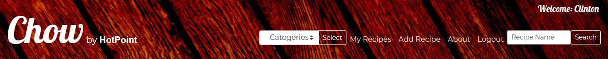

# Chow by HotPoint

## <i> Data Centric Development - Code institute </i>

---

> **Chow by HotPoint** is a Web based cook book that allows anyone to upload a recipe and share it with the world.

---

[](http://shields.io/) [](https://GitHub.com/Naereen/StrapDown.js/graphs/commit-activity) [](https://www.python.org/downloads/release/python-360/) [](https://shields.io/) [](https://shields.io/)

## Demo

[](https://chow-flask-mongodb.herokuapp.com/all_recipe)

---

## Table of Contents

1. [**UX**](#ux)
2. [**Scope**](#scope)
3. [**Structure and Wireframe Mockups**](#structure)
4. [**Surface**](#surface)
5. [**Technologies**](#technologies)
6. [**Features**](#features)
7. [**Testing**](#testing)
8. [**Bugs**](#bugs)
9. [**Deployment**](#deployment)
10. [**Credits & Acknowledgements**](#credits)

---

## UX

My directive was to make an online cookbook that users could find and share recipes, at the same time promoting the Hotpoint brand. The main focus is on 'recipes' and associating Chow and Hotpoint with good food. Hotpoint wants Chow to have a warm, cosy, country kitchen feel. Some pictures of there products, where possible. But selling is not the main focus.

### User Stories

1. I would like to be able to look up recipes from my favourite chefs.

2. I would like to have all of my recipes in one place.

3. I would also like to be able to edit them if on the app.

4. I would like to have my friends and family share our recipies we like so we can all enjoy them.

---

[Back to Top](#table-of-contents)

## Scope

**Chow by HotPoint** is a web-based cookbook that allows the public to browse through user uploaded recipies. Anyone can choose a recipe and get a list of ingredients and cooking instruction. If the public would like to contribute to the collection, they would have to become a user.
To become a user, you would have to register. Once registered, the user can keep a collection of their own with full editing or delete capabilities.

The web app is made using [Python](https://www.python.org/) and [JavaScript](https://developer.mozilla.org/en-US/docs/Web/JavaScript) as the main logical languages [Flask](<https://en.wikipedia.org/wiki/Flask_(web_framework)>) and [Boostrap](https://getbootstrap.com/) Frameworks with [Mongodb Altas](https://www.mongodb.com/) for the database.

The client, HotPoint, has a wide range of products that cover all things a house should have. At the heart of every home is the kitchen. This is 'Chows' focus. The logo "Chow by Hotpoint" is the main title. It will be on every page. Pictures of the products will be strategically placed throughout the site, with links to their main product selling website.

---

[Back to Top](#table-of-contents)

## Structure

There are five main pages, two error handing pages and one 'Base' page. Because we are using [Flask](<https://en.wikipedia.org/wiki/Flask_(web_framework)>) we are able to utlise the [Jinja2](https://jinja.palletsprojects.com/en/2.11.x/) templating lanuguage. Therefore the 'Base' page is the same in all pages in the site. This is the reason it contains the Navigation and the footer. [Boostrap](https://getbootstrap.com/) framework allows the website to be fully responsive.

---

#### **Navigation**

On the left hand side you see the Logo. It is made with two parts. The 'Chow' image and the 'HotPoint' logo. The 'Chow' image is clickable and will refresh the page. The 'HotPoint' logo is also clickable and will redirect you to the Hot Point web page.
On the right are the navigate buttons. _Catergory drop down menu / Add Recipe / About / Login / Search bar_.

_**Catergory drop down menu**_: Is a list of catergories to choose from.

- _**Categories**_ Only the recipes in that catergory will be shown. If no category is selected, a list of all the recipes will be shown in order from newest to oldest.
- _**Chefs**_ (Authors of the recipes)This will show all the chefs in alphabetical order.
- _**Serving**_: This will show the recipes in order of serving size from smallest to largest.

_**Add Recipe**_: This will redirct you to the add recipe page if you are logged in, other wise if will redirct you to the login in page. If the user has not registered with Chow before, there is a link to do so in the login page.

_**About**_: This will send the user to a page with a description of Chow and HotPoint. There are two button, 'Go Back' or 'Learn More'.

- Go Back - will bring you back to Chow main page

- Learn More - Will redirct you to Hot Point's main web page

_**Login**_ : Here you will be redircted to the Login/Registration page. Its a simple form where the user email and password are required.

_**Registration**_: Is the same as the Login form but with a Nick name / Username input. Once the username has been added it can not be change.

<details>
<summary>Navigation</summary>

<p align="center">

</p>

</details>

---

#### **All Recipes**

All Recipes is the first page we get to see, all the recipes uploaded by the users are seen here. The page is "Card" based with a 'snap shot' of the details and a web-based image of the dish. The order is newest first by default.
The design of this is made for browsing, to be scanned over when looking for dinner tonight. Once the recipe is selected, the "Lets Chow" button brings you to the Recipe page.

<details>
<summary>All Recipes Wireframes</summary>

<p align="center">

</p>
<p align="center">

</p>
</details>

---

#### **Recipe**

The recipe page is a center block format with all the details of the recipe,
the name with a short description and dish image.
Here you will find all the details you will need to make the dish,
a list of all the Ingredients and cooking instructions neatly laid out and easy to read.
It is from here you will be given the option to edit or delete a recipe. If you are the uploader of the recipe.

<details>
<summary>Recipes Wireframes</summary>

<p align="center">

</p>
<p align="center">

</p>
</details>

---

#### **Add Recipe**

This page is a form formate it has all the inputs you will need to upload a recipe. We have incorporated a text editor called [CKEditor](https://ckeditor.com/) to help with keeping it very neat and ordered.
All the input will have to be used to add a recipe; there is form validation.

<details>
<summary>Add Recipes Wireframes</summary>

<p align="center">

</p>
<p align="center">

</p>
</details>

---

#### **Edit Recipe**

The Edit page is a copy of the 'Add Recipe' page with a few exceptions.
The inputs are filled with the values of the recipe. So the user only has to change what they want to. The entire form does not have to be refilled.

<details>
<summary>Add Recipes Wireframes</summary>

<p align="center">

</p>
<p align="center">

</p>
</details>

---

#### **About**

The About page has a centre block format with a heading and information about Chow and HotPoint.

<details>
<summary>About Page Wireframes</summary>

<p align="center">

</p>
</details>

---

[Back to Top](#table-of-contents)

## Surface

#### Fonts

- [Montserrat](https://fonts.google.com/specimen/Montserrat?query=montserrat) - Primary Font
- [Lobster](https://fonts.google.com/specimen/Lobster?query=lob) - Secondary Font
- [Baloo Chetten 2](https://fonts.google.com/specimen/Baloo+Chettan+2?query=Baloo) - Supplementary Font

The primary font <a href="https://fonts.google.com/specimen/Montserrat?query=montserrat">Montserrat</a> is in the body of all pages. I chose it because of its readability and accessibility. It complements the secondary font.
The Secondary is <a href="https://fonts.google.com/specimen/Lobster?query=lob">Lobster</a> is in the Heading and buttons, It is a big font with a very open face, has a good readability and fits the look we wanted.
The supplementary font <a href="https://fonts.google.com/specimen/Baloo+Chettan+2?query=Baloo">Baloo Chetten 2</a> is the clients logo font.
The backup font "Sans-Serif" is the most popular backup in case there is a loading issue the web page always has a font.

---

#### Colour Scheme

-  `rgb(233, 217, 202)` - Primary-(Jumbo)
-  `rbg(114, 8, 11)` - Secondary (Header and Footer)
-  `rgb(186, 157, 129)` - Supplementary colour 1
-  `rgb(92, 73, 62)` - Supplementary colour 2
-  `rgb(189, 172, 82)` - Supplementary colour 3

The Colour scheme has earthy natural colours. The supplementary colours    are a mix of colours used in the background image that is throughout. The secondary colour  is used for the Header/Navigation and the footer, the colour itself is from a picture of wooden floorboards that have had a deep red varnish and the picture was colour saturated and contrast sharpened to give it a look we whereafter.
Primary colour  is a soft natural almost skin colour, it contrasts nicely with the text and is used as a background colour.

---

#### Images

Images are used extensively. The pictures we chose created the colour theme and worked well together.

The background image is a country kitchen. We added a light filter to it, so it would not take away from the main content of the page.

<details>
<summary>BackGround Image</summary>
 
<p align="center">

</p>
</details>
 
---
 
The Header and footer image of a wooden floor has been adjusted to give it a deep red colour. The colour complements the background image.
 
<details>
<summary>Header and Footer Image</summary>
 
<p align="center">

</p>
</details>
 
---
 
[Back to Top](#table-of-contents)
 
## Technologies
 
##### Core Languages, Frameworks, Editors
 
- [HTML 5](https://en.wikipedia.org/wiki/HTML) ~ Markup language designed to be displayed in a web browser.
- [CSS 3](https://en.wikipedia.org/wiki/Cascading_Style_Sheets) ~ Style sheet language used for describing the presentation of a document in HTML.
- [Python 3.8](https://code.jquery.com/) ~ High-level, general-purpose programming language.
- [jQuery 3.5](https://code.jquery.com/) ~ lightweight JavaScript library.
 
- [Flask 1.1.2](https://flask-doc.readthedocs.io/en/latest/#) ~ Micro web framework.
 
- [Bootstrap 4.5](https://getbootstrap.com/) ~ Design and customize responsive mobile-first sites.
 
- [Visual Studio Code](https://code.visualstudio.com/) ~ Code editor redefined and optimized for building and debugging modern web and cloud applications.
- [Heroku](https://heroku.com) ~ A cloud based platform as a service enabling deployment of CRUD applications
 
##### Third-Party Tools
 
- [MongoDB Atlas](https://www.mongodb.com/cloud/atlas) ~ MongoDB Atlas is the global cloud database service for modern applications.
 
- [Icons - Materialize](https://materializecss.com/icons.html) ~ Material Design icons
- [GitHub](https://github.com/) ~ Distributed version control and source code management (SCM) functionality of Git, plus its own features.
- [Git](https://git-scm.com/) ~ Distributed version control system
- [Figma](https://www.figma.com/) ~ A digital design and prototyping tool. It is a UI and UX design application that you can use to create websites, apps.
- [Slack](https://slack.com/intl/en-ie/) ~ A workspaces allow you to organize communications by channels for group discussions and allows for private messages to share information.
- [Website Responsive Testing](https://responsivetesttool.com) ~ A means of testing the website or URL from different devices.
- [Pep8online](http://pep8online.com/) ~ PEP 8 is a online Python style guide. It's a set of rules for how to format your Python code.
- [W3 Validator](https://validator.w3.org/nu/) ~ The Markup Validation Service.
- [W3C CSS Validation](https://jigsaw.w3.org/css-validator/) ~ A CSS validator checks your Cascading Style Sheets to make sure that they comply with the CSS standards set by the W3 Consortium.
- [TinyPNG](https://tinypng.com/) ~ A smart lossy compression technique to reduce the file size of your PNG files.
- [Google Fonts](https://fonts.google.com/) ~ A library free licensed font families, an interactive web directory for browsing the library.
- [CSSMatric](https://cssmatic.com/) ~ Automatically generates the code and shows you the effects in real time.
 
---
 
[Back to Top](#table-of-contents)
 
## Features
 
- **Registration:**
  Anyone can register to use Chow. Email, username and password are required.
 
- **Password Encryption:**
  Users passwords are secure as they are not sorted in the database, We use a python library called [Bcrypt](https://bcrypt-generator.com/) to encrypt the password. We store only the encrypted password. Even if the database gets hacked, the password can not be stolen.
 
- **No Duplicate users:**
  We use the email address to check users' login, as emails by nature are unique.
 
- **Dynamic login/logout menu items:**
  In the navigation header and footer the menu item login and logout changes dynamically if a user is logged in, or out.
 
- **Footer login:**
  There is a handy login section in the footer. That is also dynamically hidden if the user is logged in.
 
- **User Only CRUD:**
 
  - Only a logged-in user may upload a new recipe.
 
  - Only the user that has uploaded the recipe may edit or delete it, and this is done by:
 
    - By checking to see if the logged in username is the same as the username that is added to the recipe when uploaded.
    - Hiding the 'Delete' and 'Edit' button if the usernames don't match.
 
- **Category Select Button:**
  Lets the user narrow down the list of recipes to browse from.
 
- **Search Bar:**
  We implemented the search bar to help users pinpoint a recipe they are looking for. The search bar searches for a word or a sentence in the name of the recipe. If there are multiple results, a list of all results are shone.
 
### Future Features
 
- **A user profile page:** A profile section for the users.
- **A star rating system:** To be able to sort the recipes from best down.
- **A comments section in the recipes:** A comment section to leave advice or ideas to future users.
- **A users favourite section:** To mark as favours tag so the users may keep a list of all the recipes they enjoyed the most and want to keep in their profile.
- **A cloud-based image library:** The user may upload their own images. That gets stored in the cloud-based library. That optimizes the images and will speed up the loading time.
 
---
 
[Back to Top](#table-of-contents)
 
## Testing
 
- The first phase of testing is a step by step basis. As I implemented a new code, I would run the app on my localhost with the debugger on. If any of the Flask routes did not work, the debugger would catch them.
 
- If the routes are loaded, I tested them on Chrome and Firefox Developer Tools.
 
- I tested HTML with w3 Validator. I got an illegal character from [Jinja2](https://jinja.palletsprojects.com/en/2.11.x/) templates. They are acceptable errors as Flask needs the templates to connect throughout the site.
 
- I tested CSS with W3 CSS Validator. I only got errors with CSS Variables. The reason I use variables in the `:root`, is if the client needs to change a 'Font' or a 'Background colour', We only have to change it in one place, the `:root`, that changes it everywhere on the site.
- These errors are an ongoing issue with W3, They are valid, but not recognised by W3. '[CSS variables ("custom properties"), a widely supported and crucial feature.CSS-Validator issues 111](https://github.com/w3c/css-validator/issues/111)'
 
- After the [jQuery](https://code.jquery.com/) was completed, I ran through the code to make sure it was working.
 
- I tested all the links to make sure they all worked as intended.
 
- I tested the CRUD capabilities to make sure they all worked.
 
- I tested the registration and login route.
 
- I tested the 'Contact Us' link to ensure the correct email and subject are preloaded into the user email client.
 
- I tested the forms for form validation, making sure it displayed the Error message if input fields do not meet criteria.
 
- I sent it to the Slack Community for Feedback.
 
- I run the application through [Website Responsive Testing](https://responsivetesttool.com) to make sure it is responsive. Below is a list of devices:
 
 <details>
<summary>Mobiles</summary> 
<ul>
<li>Apple iPhone 3/4/4s/5/5s/6/6s/6plus/7/7Plus/8/8Plus/X/XR/XS/XSMax</li>
<li>Nexus 6P/5X</li>
<li>Google Pixel 2/XL</li>
<li>Samsung Galaxy S S2/S3/S4/S5/S6/S7/S8/S8+/S9/S9+</li>
<li>Samsung Galaxy Nexus/Note 2/3/4/8</li>
<li>LG G3/G4/G5</li>
<li>LG Optimus G</li>
<li>LG Nexus 4/5</li>
<li>Pantech Vega n6</li>
<li>Lenovo K900</li></li>
<li>Motorola Nexus 6</li>
<li>One Plus 3</li>
<li>Nexus 7(2013)/9</li>
<li>ZTE Grand S</li>
<li>HTC One/8X/Evo 3D</li>
<li>Sony Xperia P/S/Z/Z3</li>
<li>Xiaomi Redmi Note 5</li>
<li>Xiaomi Mi 3/4</li>
<li>Blackberry Z10/Z30/Q10/CLASSIC/PASSPORT/LEAP</li>
<li>Blackberry Torch 9800</li>
<li>Microsoft Lumia 620/830/900/920/925/1020/1520</li>
</details>
 <details>
<summary>Tablet</summary> 
<ul>
<li>Apple iPad Pro/Pro9.7/1/2/mini</li>
<li>Samsung Galaxy Tab 3 10"/Tab 2 10"/Tab (8.9")/Tab 2 (7")</li>
<li>Samsung Nexus 10</li>
<li>HTC Nexus 9</li>
<li>Asus Nexus 7 (v1)/(v2)</li>
<li>LG G Pad 8.3</li>
<li>Amazon Kindle Fire/HD7/HD8.9</li>
<li>Microsoft Surface Pro 2/3</li>
<li>Blackberry Playbook</li>
</details>
  <details>
<summary>Desktops</summary> 
<ul>
 
<li>Desktop/Laptop</li>
<li>1024 x 768</li>
<li>1280 x 800</li>
<li>1366 x 768</li>
<li>1440 x 900</li>
<li>1680 x 1050</li>
<li>1920 x 1080</li>
<li>1920 x 1200</li>
<li>2560 x 1440</li>
<li>3840 x 2160</li>
<li>4096 x 2304</li>
<li>5120 x 2880</li>
</details>
 
---
 
[Back to Top](#table-of-contents)
 
## Bugs
 
**Being able to login with a different username.**
On registration the username/email and password get logged to the database. When the user logged in again, only the email was checked for duplets. The problem was the user could login with the right email and password but wrong username.
Upon adding a new recipe, the recipes get tagged with the username from `Sessions`, which means if the user logged in with a different username but correct email and password, they get logged in but not able edit/delete their recipe.
My first fix was to add the username input on the login page and have the username from the form checked with the username from the database. But this adds another input is not good UX.
 
> To fix this issue, The user only inputs the username once at registration. At login, once the email and passwords get checked, The `Sessions` is created using the stored username. taking away the need for a username input when logging in.
 
```python
login_user = users.find_one({'email': request.form['userEmail']})
session['username'] = login_user['name']
session['logged_in'] = True
 
```
 
**Case Sensitivity**
In my testing, I found that users are using capital letters when entering their email addresses, this causes an issue if we need to use their emails later on.
 
> I used the `.lower()` method to keep all email in lower case
 
**Search Bar case sensitivity**
I had a bug with the search bar not being able to pick out the words in a search, because `$regex` looks for identical matchmaking it case sensitive.
 
> My fix was to add the optional `$options` to the query, using the `'i'` makes it case-insensitive.
 
```python
recipes = list(mongo.db.recipes.find({
        "recipe_name": {"$regex": f'.*{search_text}.*', '$options': 'i'}}))
 
```
 
**Category Drop-Down Menu**
I had an issue with using hyperlink tags `<a>` in the category drop-down menu in the Navigation bar because they use `href`. The only way to get the choisen link into flask is with [Jinja2](https://jinja.palletsprojects.com/en/2.11.x/) `{{url_for}}` and can not pass through a `value` for each item. Hyperlink tags do not support the `value` attribute. I would have to take a different route for every category listed. I also wanted to include 'Chefs and Servings' as cotogeries into the drop-down menu. Giving the user a couple more sorting options.
 
> I decided to go with a form. The drop-down menu with the `select` and `options` uses a button and makes a `"POST"` request. This way I would only need 3 routes: one for the category, one for 'Chefs', and one for Servings.
> To check if Chefs and Servings are selected or not. I used an `if` statement to select the right route. The `else` of the statement would go to the category's route.
 
```python
if cat_search == "chef":
   return redirect('chef')
elif cat_search == "servings":
   return redirect('servings')
else:
 
```
 
**Rendering HTML tags instead of plain text**
The issue I had with using the [CKEditor](https://ckeditor.com/) is that it uses HTML to keep the structure of what you have typed. When recalling the edited text back to be displayed. It was rendering the HTML with tags and not plain text.
 
> My fix was to use the {{  |safe }} in the Jinja2 template.
 
---
 
[Back to Top](#table-of-contents)
 
## Deployment
 
I hosted this site using [Heroku](https://www.heroku.com/).
 
Heroku is a container-based cloud Platform as a Service (PaaS). I used it because it's free, elegant, flexible, and easy to use, offering developers the simplest path to getting my app up.

### To deploy on Heroku

<details>
<summary>Heroku Deployment Steps</summary>
<br>
<ol>
<li> Open Heroku.  
   The Heroku CLI requires Git, the popular version control system. If you don’t already have Git installed, complete the following before proceeding: - [Git installation](https://git-scm.com/book/en/v2/Getting-Started-Installing-Git) - [First-time Git setup](https://git-scm.com/book/en/v2/Getting-Started-First-Time-Git-Setup)</li>
<li> Install the Heroku Command Line Interface (CLI). You use the CLI to manage and scale your applications, provision add-ons, view your application logs, and run your application locally.</li>
<li> Create an account and navigate to dash dashboard.
   Click on the _New_ button.
   Click - _Create New App_.</li>
<li> Create a corresponding app name that we use to deploy our application. The apps _name_ must be _unique._.</li>
<li> Pick a server location what is closest to you.</li>
 
<li> In your Terminal. Navigate to you directory using.</li>
<li> Login to Heroku using the Terminal `$ heroku login`</li>
 
<li> Create a requirements.txt file: `$ pip3 freeze --local > requirements.txt.`</li>
 
<li> Create Procfile: `$ echo web: python app.py > Procfile`</li>
 
<li> Add files to Git: `$ git add .` then `git commit -m 'Added reuirements.txt and Procfile'`</li>
 
<li> Push to Heroku: `$ git push heroku master`</li>
<li> Go back to Heroku dashboard and click on the apps name, then on the 'settings' Tab.</li>
<li> Specify our IP and our port using the 'Reveal Config Vars'</li>
</ol>
</details>
 
<details>
<summary>Clone to a workstation</summary>
<br>
<ol>
<li>On GitHub, navigate to the main page of the repository.</li>
<li>Under the repository name, click Clone or download.</li>
<li>To clone the repository using HTTPS, under "Clone with HTTPS", click.</li>
<li>To clone the repository using an SSH key, including a certificate issued by your organisation's SSH certificate authority, click Use SSH, then click.</li>
<li>Open Git Bash.</li>
<li>Change the current working directory to the location where you want the cloned directory to be.</li>
<li>Change the current working directory to the location where you want the cloned directory to be.</li>
<li>Type ‘’’git clone’’’ and then paste the URL you copied in Step 2.</li><li>Press Enter. Your local Clone will be created.</li>
</ol>
</details>
---
[Back to Top](#table-of-contents)
## Credits
##### Code Tutorials
- [Julian Nash](https://www.youtube.com/channel/UC5_oFcBFlawLcFCBmU7oNZA) ~ YouTube
- [Pretty Printed](https://www.youtube.com/channel/UC-QDfvrRIDB6F0bIO4I4HkQ) ~ YouTube
- John Elder ~ [Codemy](https://codemy.com/about/)
- Febin George ~ [Udemy](https://www.udemy.com/)
- Anthony Ngene ~ Code Institute ~ Mentor
- Leonardo Monteiro Fernandes ~ [Ripple Effect](https://medium.com/@leonardo.monteiro.fernandes/css-techniques-for-material-ripple-effect-3f0ece3062a0)

##### Media

[Unsplash](https://unsplash.com/) ~ The internet’s source of freely-usable images.

- [Luca Ruegg](https://unsplash.com/s/photos/luca-ruegg)
- [Andy Chilton](https://unsplash.com/s/photos/andy-chilton)
- [BBC Food](https://www.bbc.co.uk/food) ~ for the recipes

---

#### Acknowledgements and Special Thanks

To everyone in Slack, especially how it helped me figure the Virtual Environment. My Mentor Anthony Ngene, for pushing me.
Thank you.

###### <i>Disclaimer: This project was created for educational use only as part of the Code Institute Full Stack Software Development Course for Milestone 3!</i>

[Back to Top](#table-of-contents)
